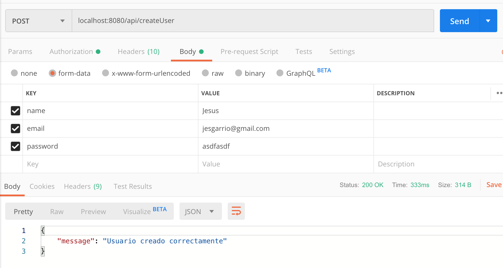
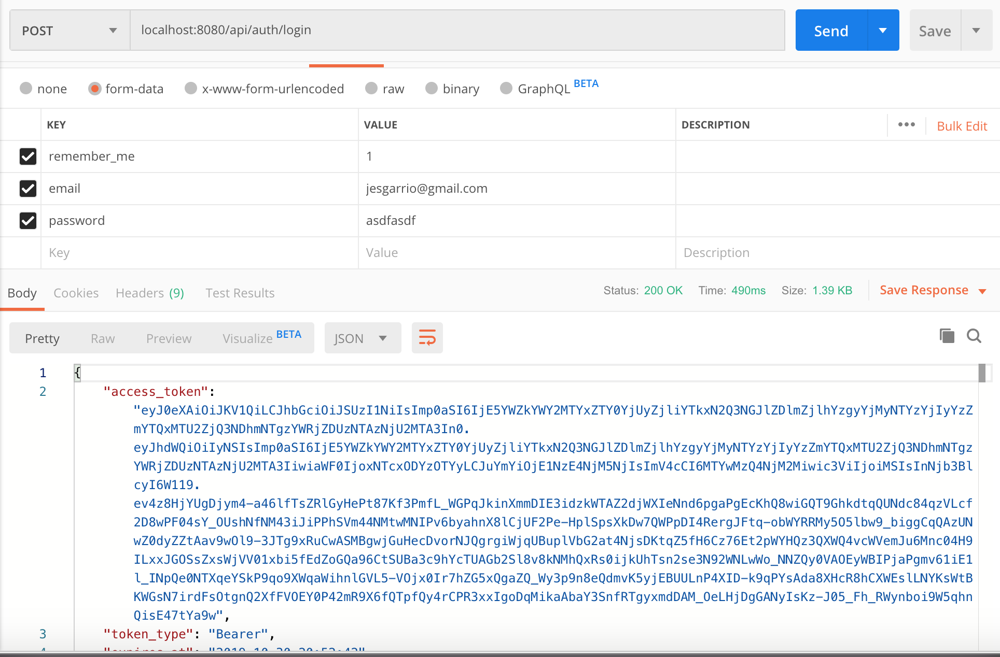
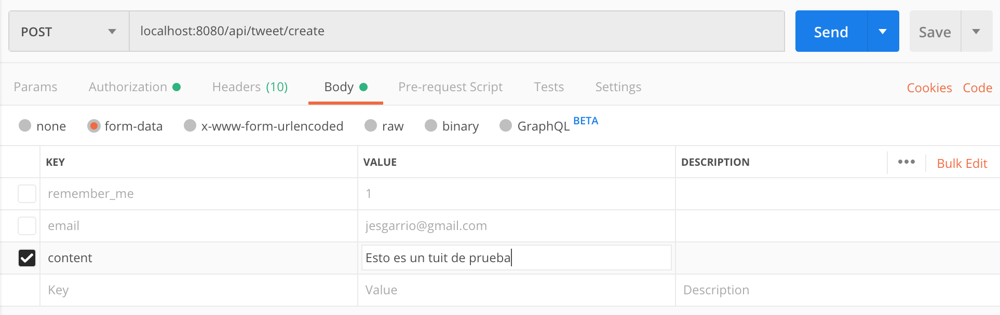
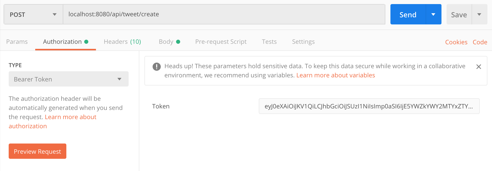
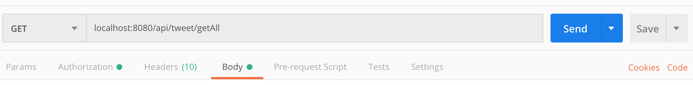
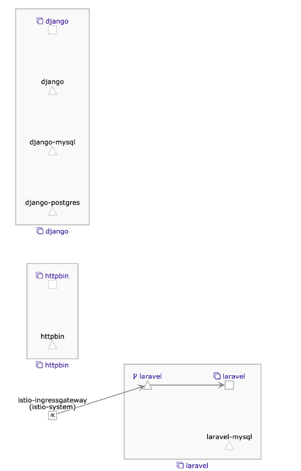

# Quick tutorial

Hello! In the following lines I'll show you how to interact with this Laravel Project.

## Installation

For the installation, you will have to execute the following steps:
1. ```kubectl create clusterrolebinding cluster-admin-binding --clusterrole cluster-admin --user $(gcloud config get-value account)```
2. ```kubectl apply -f https://raw.githubusercontent.com/kubernetes/ingress-nginx/master/deploy/static/mandatory.yaml``` 

3. Just do: ```cd k8s && kubectl apply -f . ```
NOTE: I don't really know why, but if you get any errors, in general, PHP connection to DB, just re-execute this.

## Steps

### Create an user

Using postman, you will have to make an POST API call to the following URI like image:



### Login 

Using postman, you will have to make an POST API call to the following URI like image:



NOTE: It's mandatory to save the returned token in order to make the following call method


### Create tweet
Using postman, you will have to make an POST API call to the following URI like image:



You will have to add an Authorization Bearer with the returned token before



### Get all tweets

Using postman, you will have to make a GET POST API call to the follwing URI like image:



You will have to add an Authorization Bearer with the returned token before again

### Kiali diagram

I know that's now what you were expecting to see, but I hadn't enough time to configure each service

